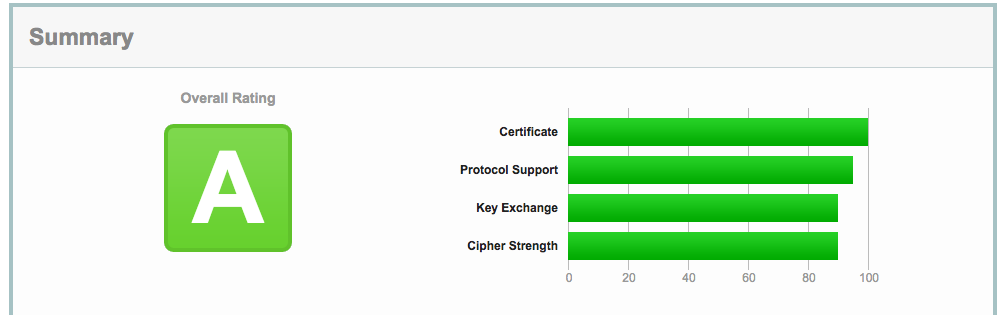

# CentOS使用letsencrypt实现HTTPS（Nginx版）
官方推荐使用Certbot来实现，有两种模式：自动模式和高级模式。本文使用自动模式。

**注意**：在开始之前，请确保你的域名已经解析到要配置的服务器上，本文以`example.com`为例。

* step1  
下载epel扩展包

```js
wget https://dl.fedoraproject.org/pub/epel/epel-release-latest-7.noarch.rpm
```

安装下载好的扩展包

```js
yum install -y epel-release-latest-7.noarch.rpm
```

* step2  
安装Certbot

```js
yum install -y certbot-nginx
```

* step3  
设置nginx配置（一定要做这一步，否则会报错），编辑`/etc/nginx/conf.d/default.conf`，将其中的：

```js
server_name  localhost;
```

修改为：

```js
server_name  example.com;
```

* step4  
获取证书，执行如下命令：

```js
certbot --nginx
```

> 按照提示设置邮箱、域名等信息即可。

* step5  
验证是否生效，访问如下网站：

```js
https://www.ssllabs.com/ssltest/analyze.html?d=example.com
```

如果出现如下图所示的结果则表示成功：



* step6  
设置自动更新证书，证书有效期是90天，设置自动更新永不过期。

设置一个cran：

```js
0 0 * * * certbot renew
```

> 每天0点更新一次。
