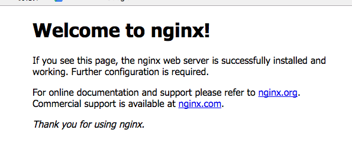

# CentOS安装Nginx
* step1  
设置yum源，新建`/etc/yum.repos.d/nginx.repo`文件并写入如下内容：

```js
[nginx]
name=nginx repo
baseurl=http://nginx.org/packages/centos/7/$basearch/
gpgcheck=0
enabled=1
```

> 注意：如果是CentOS7.x系统，上述第三行写`7`，如果是CentOS6.x系统则写`6`。

保存并退出文件。

* step2  
安装Nginx，通过执行下面的命令安装：

```js
sudo yum install -y nginx
```

* step3  
启动Nginx，通过执行下面的命令启动Nginx：

```js
sudo systemctl start nginx
```

* step4  
测试Nginx服务，打开浏览器，输入你的服务器IP地址，按回车，如果出现如下界面则表示Nginx已经成功安装并启动了：



* step5（可选）  
开启防火墙（如果step4已经成功则不需要这一步）。依次执行下面三条命令开启`HTTP`和`HTTPS`端口：

```js
sudo firewall-cmd --permanent --zone=public --add-service=http 
sudo firewall-cmd --permanent --zone=public --add-service=https
sudo firewall-cmd --reload
```

* step6（可选）  
设置开机启动，通过如下命令设置开机启动Nginx：

```js
sudo systemctl enable nginx
```