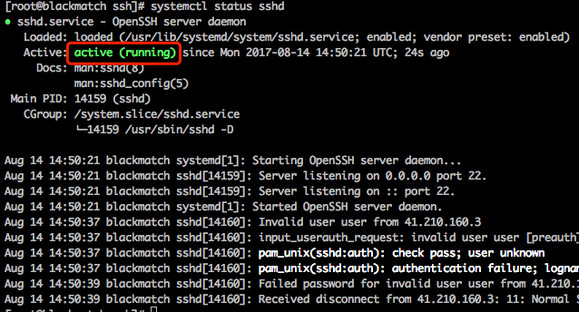

# CentOS设置ssh连接时长
* 打开`/etc/ssh/sshd_config`

```js
vim /etc/ssh/sshd_config
```

* 取消以下几个参数的注释（将最前面的#删掉即可）

**TCPKeepAlive**

**ClientAliveInterval**

**ClientAliveCountMax**

* 设置合适的参数（如下设置的是ssh连接后两小时不断开）

```js
TCPKeepAlive yes
ClientAliveInterval 60
ClientAliveCountMax 120
```

* 保存并退出文件（:wq）
* 重启sshd服务

```js
systemctl restart sshd
```

## Optional
以下为可选操作：

* 检查sshd服务是否正常开启

```js
systemctl status sshd
```

如果出现如下图的`active`字样则表示sshd服务已开启。

