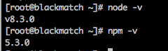

# CentOS安装Node.js

* step1（设置安装源，按照需要选择一个版本即可）

Node.js 6.x

```js
curl --silent --location https://rpm.nodesource.com/setup_6.x | sudo bash -
```

Node.js 8.x

```js
curl --silent --location https://rpm.nodesource.com/setup_8.x | sudo bash -
```

* step2 安装Node.js

```js
sudo yum -y install nodejs
```

* step3 检查是否安装成功

```js
node -v
npm -v
```

分别执行上述两个命令，如果输出相应的版本号就表示安装成功了。如下图所示：


